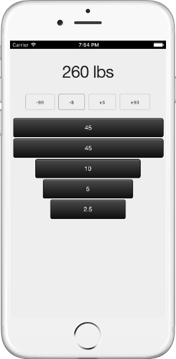
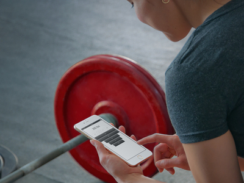

# Plate Math

Mobile web app to calculate plates for a barbell.  Great for people who don't have time to do math in a gym.  Check it out at http://henrythach.github.io/plates.

**For iOS Safari users:** Tap the share button and choose "Add to Home Screen".  This will add an icon to your home screen and you can use the app full screen.

---

## Development

Refer to [generator-webapp][1] for the full details, as the app was scaffold by it.

* Run `gulp serve` to preview and watch for changes
* Run `bower install --save <package>` to install frontend dependencies
* Run `gulp serve:test` to run the tests in the browser
* Run `gulp` to build your webapp for production
* Run `gulp serve:dist` to preview the production build
* Run `gulp deploy` to deploy the webapp to the `gh-pages` branch.

[1]: https://github.com/yeoman/generator-webapp
